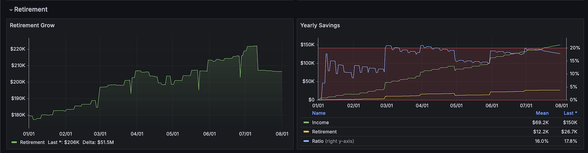

# hledger - DB - Grafana

Import [hledger](https://hledger.org/) information to a DB (in this case,
[PostgreSQL](https://www.postgresql.org/)), and visualize it using
[Grafana](https://grafana.com/) dashboards, all done using
[Docker](https://www.docker.com/).

This work was inspired by the post
_[Personal Finance](https://memo.barrucadu.co.uk/personal-finance.html)_
by [Michael Walker](https://www.barrucadu.co.uk/), and the python code was
taken and adapted from
[there](https://github.com/barrucadu/nixfiles/blob/master/hosts/nyarlathotep/jobs/hledger-export-to-promscale.py)
too.

## Assumptions

You are familiar with:

* hledger;
* Docker;
* SQL queries.

## Pre-requisites

* Docker installed;
* Have your financial journal accessible to hledger;
    * Your main categories should be _Assets_, _Liabilities_, _Income_,
      _Expenses_, and _Equity_.
    * The format of your commodities is something like `#,###.## SYMBOL`,
      i.e. the symbol of the commodity comes after the amount.

## Configuration

### CSV Files

#### Main Commodities

Update the file `postgres/csv/main_commodities.csv`, to have your list of
_main_ commodities. This is the commodities to be used by the Grafana
dashboards.

You should add the same format used in _hledger_. The list is used as a
variable in Grafana to query all the information in the desired commodity.

#### Assets Classification

Update the file `postgres/csv/assets_classification.csv`, to classify all
your _Asset_ accounts; you should have at least _Cash_, _Savings_ and
_Retirement_. See the example already included.

## Installation

1. Clone this repo.
2. Do the changes mentioned in _Configuration_.
3. Run `docker compose up -d`, this will create 3 containers:
    * PostgreSQL, running on port 5432;
    * pgAdmin, running on port 5050, used for testing SQL queries;
    * Grafana, running on port 3000.
4. Execute the script `./shell/export.sh`.
    * By default, the script uses hledger
      [internal logic](https://hledger.org/dev/hledger.html#input) to find
      the main journal file to load, it loads information for all times,
      and for all levels of accounts (sub-accounts).
    * The following is the list of optional parameters to the export
      script:
        * `-f ledger.file`: specify a different journal.
        * `-b yyyy-MM-DD`: re-create information _after_ `yyyy-MM-DD`
          (inclusive).
        * `-d #`: limit the level of sub-accounts to load.
5. Once this is done, open browser pointing to `http://localhost:3000/`.
6. There should be a dashboard created named _Main Overview_, open it and
   all the panel should display your information.
7. Once all is done, terminate the containers with `docker compose down`.
    * Optionally, you can run `docker compose down -v` to also delete all
      the volumes created, but if you do this, when you start the
      containers again, you will need to re-run the export file.

## Screenshots

After the export is done, Grafana will present one dashboard with some
basic reports, below are a small explanation of each section

### Summary

Gives you a quick look of your finances, it includes things like:

* [Net Worth](https://www.investopedia.com/terms/n/networth.asp)
* Short and Long Runaway: How many days I could survive with my current
  assets with no income.
* [FIRE number](https://www.investopedia.com/terms/f/financial-independence-retire-early-fire.asp)
* Daily averages for income and expenses
* [Credit Utilization ratio](https://www.investopedia.com/terms/c/credit-utilization-rate.asp)
* Your [expected wealth](https://themillionairenextdoor.com/2010/08/how-wealthy-should-you-be/),
  depending on your age
* Total balance for your asset classification

### Assets

Allows you to see a more detailed view of your assets, including graphs
for:

* How your assets have move over time?
* Multiple ways to see the allocation of your assets

### Ratios

See the ratios between some of your accounts, and quickly see if you are
on what others consider a "good ratio".

* [Debt-to-Income ratio](https://www.investopedia.com/terms/d/dti.asp)
* [Debt-to-Net Worth ratio](https://www.fool.com/knowledge-center/the-debt-to-net-worth-formula.aspx)
* [Debt-to-Assets ratio](https://www.investopedia.com/terms/t/totaldebttototalassets.asp)
* [Cash Flow ratio](https://www.investopedia.com/terms/c/cashflow.asp)
* [Savings ratio](https://www.investopedia.com/terms/s/savings-rate.asp)

### Retirement

Gives you an idea if you are preparing for retirement, see how much the
balance has grow, and the ratio of your income that ends up in your
retirement accounts.

## Further Configuration

The following are optional configuration that can be done to adjust the
project to your needs:

### Remove `pgAdmin` Container

The container for `pgAdmin` is optional, and used when creating new
dashboards/panels. It allows to connect to the PostgreSQL and execute
queries directly. But if there is no need for it, it can be removed.

In the `docker-compose.yaml` file, remove the lines related to `pgAdmin`
(lines 16-28), as well as the volume (line 45), and the secret (line
51-52).

The secret file (`secrets/pgadmin-pass.txt`) can also be removed.

### Different Account Names

By default, the project expects the accounts to be called _Assets_,
_Liabilities_, _Income_, _Expenses_, and _Equity_. If you use different
names, you need to update a couple of places:

#### DB Views

The file `postgres/3-views.sql` have view definitions for the DB. In
there, it uses the name of the accounts to filter, specifically:

* `average_daily_expenses` uses `Expenses`;
* `average_daily_income` uses `Income`;
* `net_worth` uses `Assets`, `Liabilities`, `Transfer`;

Also, the view `average_daily_savings` uses the classification `Savings`
from the file `postgres/csv/assets_classification.csv`. Update if needed.

#### Grafana Queries

In some of the panels in Grafana, the classification or account name is
hard-coded. If, when you open the dashboard, some of them are empty, it
could be that the query doesn't find the required info. Edit the panel to
see the exact query executed, and update the `where` condition as needed.

### Passwords

The repo includes the default passwords stored in plain-text. This is done
with the idea that the containers are used only locally. You don't need to
change the passwords if you don't want, and you only need to use them when
you connect to _pgAdmin_, and when you configure it to connect to
PostgreSQL. Grafana already have the datasource information stored, so no
need to provide the passwords.

Still, if you want to change/update the passwords, you can do it, by
updating the following places:

#### `pgAdmin` Password

* Default username: `admin@company.tld`
* Default password: `admin`

Change username by changing the value in `docker-compose.yaml`, look for
the variable called `PGADMIN_DEFAULT_EMAIL` and adjust as needed.

Change the password by changing the value inside the file
`secrets/pgadmin-pass.txt`.

#### Grafana Password

* Default username: `admin`
* Default password: `admin`

The first time you login to Grafana, it asks you if you want to change the
password.

#### PostgreSQL Password

* Default database: `admin`
* Default username: `admin`
* Default password: `admin`

Change username by changing the value in `docker-compose.yaml`, look for
the variable called `POSTGRES_USER` and adjust as needed.

The database name is going to be the same as the username (note: confirm).

Change the password by changing the value inside the file
`secrets/postgres-pass.txt`.

**Note**: Once you change any of the information, make sure you update the
following files:

* `secrets/database.ini`: Used by the python script.
* `grafana/provisioning/datasources/datasource.yml`: Used by Grafana to
  connect to the DB.
